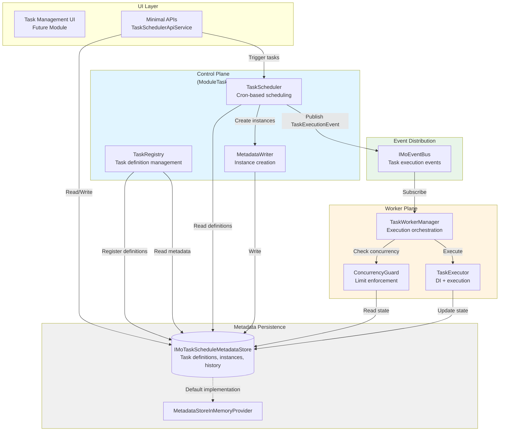
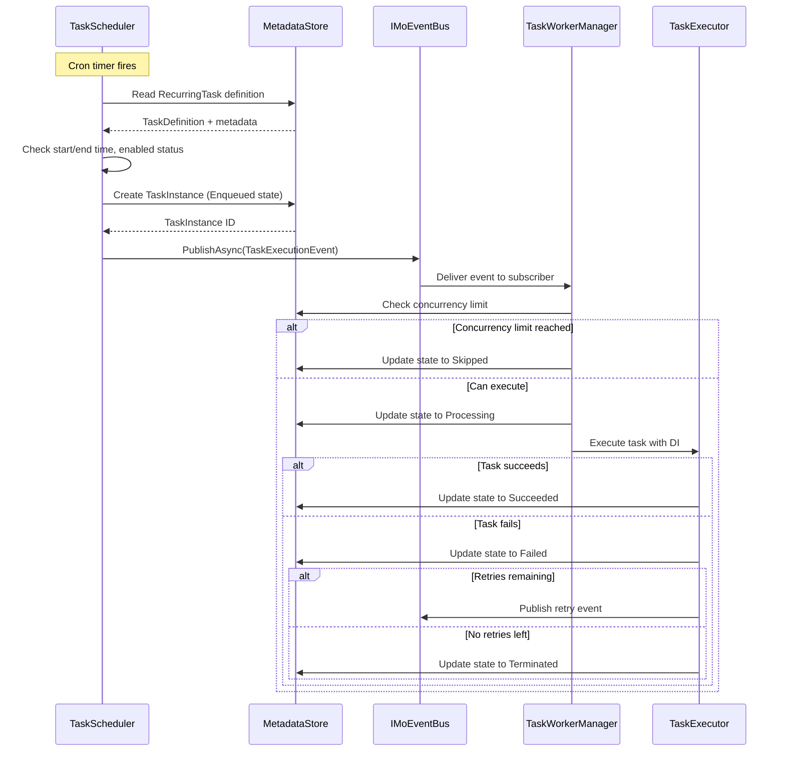
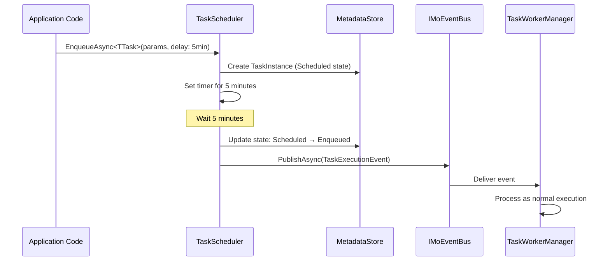

# Design Document

## Overview

MoTaskScheduler is a distributed task scheduling and execution framework designed following MoLibrary's modular architecture pattern. The system implements a centralized control plane for task orchestration and a decentralized worker execution plane for task processing. The architecture leverages MoLibrary's existing event bus (IMoEventBus) for message distribution and follows the standard module registration pattern with ModuleTaskScheduler, ModuleTaskSchedulerOption, ModuleTaskSchedulerGuide, and ModuleTaskSchedulerBuilderExtensions.

The design separates concerns into three distinct layers:
1. **Control Plane**: Task registration, scheduling, and lifecycle orchestration
2. **Worker Plane**: Task execution and state management
3. **Metadata Store**: Persistent storage for task definitions, instances, and history

## Steering Document Alignment

### Technical Standards (tech.md)

This design follows MoLibrary's technical standards:
- **Module Pattern**: Complete implementation of the four-component module pattern (Module, Option, Guide, BuilderExtensions)
- **Dependency Injection**: Primary constructors for all classes requiring DI, using IOptions<> for configuration access
- **Event-Driven Architecture**: Leveraging IMoEventBus for loose coupling between control and worker planes
- **Abstraction Layers**: IMoTaskScheduleMetadataStore abstraction for pluggable persistence

### Project Structure (structure.md)

The implementation follows MoLibrary's project organization:
- Location: `MoLibrary.TaskScheduler/` project (already exists)
- Namespace: `MoLibrary.TaskScheduler`
- Module registration through WebApplicationBuilder extensions
- Automatic middleware registration via module system
- Minimal APIs registered during module initialization, implemented using injected services (not controllers)

## Code Reuse Analysis

### Existing Components to Leverage

- **IMoEventBus** (`MoLibrary.EventBus`): Message broker for task execution requests
  - Usage: Publishing task execution events from control plane to workers
  - Integration: Workers subscribe to task execution event types

- **MoModule<TModuleSelf, TModuleOption, TModuleGuide>** (`MoLibrary.Core`): Base module class
  - Usage: ModuleTaskScheduler inherits from this to integrate with module system
  - Provides: ConfigureBuilder, ConfigureServices, PostConfigureServices, ConfigureApplicationBuilder lifecycle hooks

- **MoModuleOption<TModuleSelf>** (`MoLibrary.Core`): Base option class
  - Usage: ModuleTaskSchedulerOption inherits for configuration management
  - Provides: Logging, module registration infrastructure

- **MoModuleGuide<TModuleSelf, TModuleOption, TModuleGuide>** (`MoLibrary.Core`): Fluent configuration builder
  - Usage: ModuleTaskSchedulerGuide for builder pattern configuration
  - Provides: Middleware ordering, service configuration chaining

- **IOptions<TOption>** / **IOptionsSnapshot<TOption>** (Microsoft.Extensions.Options): Configuration injection
  - Usage: Injecting ModuleTaskSchedulerOption throughout the system
  - Pattern: Primary constructor injection for all services

- **IMoCancellationManager** (`MoLibrary.StateStore`): Distributed cancellation token management
  - Usage: Create and manage cancellation tokens for task execution, timeout enforcement, and manual cancellation
  - Integration: TaskExecutor uses `GetOrCreateTokenAsync(instanceId)` at task start, `CancelTokenAsync(instanceId)` for timeout/manual cancel, `DeleteTokenAsync(instanceId)` at task completion
  - Benefits: Enables distributed cancellation across multiple worker instances, supports manual task cancellation from UI/API

### Integration Points

- **Event Bus System**: Task execution requests published as events, workers subscribe and handle
- **Module System**: Automatic registration and dependency management via MoModule infrastructure
- **DI Container**: Task instances created with resolved dependencies from service provider
- **Configuration System**: Leveraging ASP.NET Core configuration for module options

## Architecture

The architecture implements a publish-subscribe pattern with centralized metadata management and decentralized execution.

### Modular Design Principles

- **Single File Responsibility**: Each component (scheduler, worker, metadata store) in separate files
- **Component Isolation**: Control plane, worker plane, and metadata layer independently testable
- **Service Layer Separation**:
  - Data access: IMoTaskScheduleMetadataStore implementations
  - Business logic: TaskScheduler (control plane), TaskWorkerManager (worker plane)
  - Presentation: Minimal APIs with injected services for API layer
- **Utility Modularity**: Task state machine, cron parser, task registry in focused modules



### System Flow: Recurring Task Execution



### System Flow: Triggered Task with Delay



## Components and Interfaces

### Control Plane Components

#### TaskScheduler
- **Purpose:** Orchestrates recurring task scheduling based on cron expressions and manages triggered task delays
- **Interfaces:**
  - `Task StartAsync(CancellationToken)`: Initialize scheduler, load task definitions
  - `Task StopAsync(CancellationToken)`: Graceful shutdown, cancel pending timers
  - `Task<string> EnqueueAsync<TTask>(object? parameters = null, TimeSpan? delay = null)`: Submit triggered task
  - `Task PauseRecurringTaskAsync(string taskKey)`: Disable cron scheduling
  - `Task ResumeRecurringTaskAsync(string taskKey)`: Enable cron scheduling
- **Dependencies:**
  - `IOptions<ModuleTaskSchedulerOption>`: Configuration
  - `IMoTaskScheduleMetadataStore`: Read task definitions, create instances
  - `IMoEventBus`: Publish task execution events
  - `ILogger<TaskScheduler>`: Logging
- **Reuses:** Cron parser library (e.g., Cronos), .NET Timer for scheduling

#### TaskRegistry
- **Purpose:** Manages task definition registration and metadata synchronization
- **Interfaces:**
  - `Task<IEnumerable<string>> CheckUnregisteredAsync(IEnumerable<string> taskKeys)`: Return keys not in metadata store
  - `Task RegisterTasksAsync(IEnumerable<TaskDefinition> definitions)`: Persist task definitions
  - `Task<TaskDefinition> GetDefinitionAsync(string taskKey)`: Retrieve task metadata
- **Dependencies:**
  - `IMoTaskScheduleMetadataStore`: Persistence layer
  - `ILogger<TaskRegistry>`: Logging
- **Reuses:** Reflection-based type scanning for task discovery

#### MetadataWriter
- **Purpose:** Creates task instances and validates state transitions
- **Interfaces:**
  - `Task<string> CreateInstanceAsync(TaskDefinition definition, object? parameters, TaskState initialState)`: Create instance, return ID
  - `Task UpdateStateAsync(string instanceId, TaskState newState, string? errorMessage = null)`: Transition state
- **Dependencies:**
  - `IMoTaskScheduleMetadataStore`: Persistence
  - `ILogger<MetadataWriter>`: Logging
- **Reuses:** State machine pattern for valid transitions

### Worker Plane Components

#### TaskWorkerManager
- **Purpose:** Coordinates task execution across worker threads, manages event subscriptions
- **Interfaces:**
  - `Task StartAsync(CancellationToken)`: Subscribe to task execution events
  - `Task StopAsync(CancellationToken)`: Unsubscribe, wait for in-flight tasks
  - `Task HandleTaskExecutionAsync(TaskExecutionEvent event)`: Event handler
- **Dependencies:**
  - `IOptions<ModuleTaskSchedulerOption>`: Worker configuration (thread limits)
  - `IMoEventBus`: Subscribe to TaskExecutionEvent
  - `IServiceProvider`: Create task execution scopes
  - `ConcurrencyGuard`: Enforce concurrency limits
  - `TaskExecutor`: Execute task instances
  - `ILogger<TaskWorkerManager>`: Logging
- **Reuses:** SemaphoreSlim for thread limit enforcement (if MaxExecutionThreads configured)

#### TaskExecutor
- **Purpose:** Executes individual task instances with dependency injection and timeout handling
- **Interfaces:**
  - `Task<TaskExecutionResult> ExecuteAsync(TaskInstance instance, CancellationToken cancellationToken)`: Execute task
- **Dependencies:**
  - `IServiceProvider`: Resolve task dependencies
  - `IMoTaskScheduleMetadataStore`: Update task state during execution
  - `IMoCancellationManager`: Create and manage distributed cancellation tokens for task execution and timeout
  - `ILogger<TaskExecutor>`: Logging
- **Reuses:** IMoCancellationManager for distributed timeout enforcement and manual cancellation, Task.WhenAny for timeout detection

#### ConcurrencyGuard
- **Purpose:** Enforces maximum concurrency limits per task key
- **Interfaces:**
  - `Task<bool> TryAcquireAsync(string taskKey, int maxConcurrency)`: Attempt to acquire execution slot
  - `Task ReleaseAsync(string taskKey)`: Release execution slot
- **Dependencies:**
  - `IMoTaskScheduleMetadataStore`: Query current processing count by task key
- **Reuses:** In-memory concurrent dictionary for tracking + metadata store query

#### Task Cancellation Management
- **Purpose:** Provides distributed cancellation token management for task execution and manual cancellation
- **Implementation:** Uses `IMoCancellationManager` from MoLibrary.StateStore
- **Cancellation Key:** Task instance ID (`instanceId`) used as the cancellation token key
- **Cancellation Scenarios:**
  1. **Manual Cancellation (via API):** Administrator calls cancel API → TaskSchedulerApiService calls `IMoCancellationManager.CancelTokenAsync(instanceId)` → Cancellation propagates to worker executing the task
  2. **Timeout Enforcement:** TaskExecutor detects timeout → Calls `IMoCancellationManager.CancelTokenAsync(instanceId)` → Task receives cancellation signal via CancellationToken
  3. **Graceful Shutdown:** When worker stops, all in-progress tasks receive cancellation via their respective tokens
- **Token Lifecycle:**
  1. Task execution starts → TaskExecutor calls `IMoCancellationManager.GetOrCreateTokenAsync(instanceId)` → Returns CancellationToken passed to task's ExecuteAsync method
  2. Task completes/fails/cancels → TaskExecutor calls `IMoCancellationManager.DeleteTokenAsync(instanceId)` → Cleanup cancellation token resources
- **Benefits:**
  - Supports distributed cancellation across multiple worker instances
  - Manual cancellation from UI/API propagates to any worker executing the task
  - Timeout enforcement works even if task migrates between workers

### Shared Components

#### TaskDefinition
- **Purpose:** Represents task metadata and configuration
- **Properties:**
  - `string TaskKey`: Unique identifier (TypeFullName)
  - `string TaskName`: Human-readable name
  - `string? Description`: Task description
  - `TaskType Type`: Recurring or Triggered
  - `int MaxConcurrency`: Concurrent execution limit
  - `int RetryCount`: Automatic retry count
  - `TimeSpan MaxExecutionTimeout`: Execution timeout
  - `bool IsDisabled`: Enabled/disabled flag
  - `string? CronExpression`: Cron schedule (recurring tasks only)
  - `DateTime? StartTime`: Task start time (recurring tasks)
  - `DateTime? EndTime`: Task end time (recurring tasks)
  - `Type TaskType`: CLR type for instantiation
  - `Type? ParameterType`: Parameter type for triggered tasks

#### TaskInstance
- **Purpose:** Represents a single task execution request
- **Properties:**
  - `string InstanceId`: Unique instance identifier
  - `string TaskKey`: Reference to task definition
  - `TaskState State`: Current execution state
  - `string? Parameters`: JSON-serialized parameters (triggered tasks)
  - `DateTime CreatedAt`: Instance creation timestamp
  - `DateTime? ScheduledFor`: Scheduled execution time (delayed tasks)
  - `DateTime? StartedAt`: Execution start timestamp
  - `DateTime? CompletedAt`: Execution completion timestamp
  - `string? ErrorMessage`: Error details (failed tasks)
  - `int RetryAttempt`: Current retry attempt number

#### IMoTaskScheduleMetadataStore
- **Purpose:** Abstraction for task metadata persistence
- **Interfaces:**
  - **Task Definitions:**
    - `Task<TaskDefinition?> GetTaskDefinitionAsync(string taskKey)`
    - `Task<IEnumerable<TaskDefinition>> GetAllTaskDefinitionsAsync()`
    - `Task SaveTaskDefinitionAsync(TaskDefinition definition)`
    - `Task<bool> TaskDefinitionExistsAsync(string taskKey)`
  - **Task Instances:**
    - `Task<TaskInstance?> GetTaskInstanceAsync(string instanceId)`
    - `Task<IEnumerable<TaskInstance>> GetTaskInstancesByKeyAsync(string taskKey, TaskState? stateFilter = null)`
    - `Task<int> GetProcessingCountAsync(string taskKey)`
    - `Task SaveTaskInstanceAsync(TaskInstance instance)`
    - `Task UpdateTaskStateAsync(string instanceId, TaskState newState, string? errorMessage = null)`
  - **Task History:**
    - `Task ArchiveTaskInstanceAsync(TaskInstance instance)`
    - `Task<IEnumerable<TaskInstance>> GetTaskHistoryAsync(string taskKey, int pageSize, int pageNumber)`
- **Implementations:**
  - `MetadataStoreInMemoryProvider`: Default in-memory implementation using ConcurrentDictionary

### Module Components

#### ModuleTaskScheduler
- **Purpose:** MoLibrary module implementation for task scheduler integration
- **Base Class:** `MoModule<ModuleTaskScheduler, ModuleTaskSchedulerOption, ModuleTaskSchedulerGuide>`
- **Lifecycle Hooks:**
  - `ConfigureServices`: Register all services (TaskScheduler, TaskWorkerManager, metadata store, etc.)
  - `PostConfigureServices`: Scan assemblies for RecurringTask/TriggeredTask types, register to DI
  - `ConfigureApplicationBuilder`: Start TaskScheduler and TaskWorkerManager background services
- **Dependencies:**
  - `ModuleTaskSchedulerOption`: Configuration

#### ModuleTaskSchedulerOption
- **Purpose:** Configuration model for task scheduler module
- **Base Class:** `MoModuleOption<ModuleTaskScheduler>`
- **Properties:**
  - `bool RecurringTaskDebugMode`: Disable automatic recurring task execution
  - `bool TriggeredTaskDebugMode`: Disable automatic triggered task execution
  - `int? MaxWorkerExecutionThreads`: Worker thread pool limit (null = unlimited)
  - `Type? CustomMetadataStoreType`: Custom metadata store implementation type

#### ModuleTaskSchedulerGuide
- **Purpose:** Fluent configuration builder for task scheduler
- **Base Class:** `MoModuleGuide<ModuleTaskScheduler, ModuleTaskSchedulerOption, ModuleTaskSchedulerGuide>`
- **Methods:**
  - `ModuleTaskSchedulerGuide UseCustomMetadataStore<TStore>() where TStore : IMoTaskScheduleMetadataStore`: Register custom store
- **Note:** Debug modes and thread limits are configured directly in ModuleTaskSchedulerOption

#### ModuleTaskSchedulerBuilderExtensions
- **Purpose:** WebApplicationBuilder extension methods
- **Methods:**
  - `static ModuleTaskSchedulerGuide ConfigMoTaskScheduler(this WebApplicationBuilder builder, Action<ModuleTaskSchedulerOption>? configure = null)`: Register module with option configuration

### Task Base Classes

#### RecurringTask
- **Purpose:** Base class for recurring scheduled tasks
- **Abstract Members:**
  - `Task ExecuteAsync(CancellationToken cancellationToken)`: Task execution logic
- **Attributes:**
  - `[TaskConfig]`: Consolidated attribute for all task configuration
    - Properties: `TaskKey`, `TaskName`, `Description`, `MaxConcurrency`, `RetryCount`, `MaxExecutionTimeout`, `CronSchedule`, `StartTime`, `EndTime`, `IsDisabled`
    - All properties are optional with sensible defaults (TaskKey defaults to TypeFullName, MaxConcurrency defaults to 1, etc.)
- **Dependencies:** Constructor supports DI

#### TriggeredTask<TParam>
- **Purpose:** Base class for triggered tasks with typed parameters
- **Abstract Members:**
  - `Task ExecuteAsync(TParam parameters, CancellationToken cancellationToken)`: Task execution logic with parameters
- **Attributes:**
  - `[TaskConfig]`: Consolidated attribute for all task configuration
    - Properties: `TaskKey`, `TaskName`, `Description`, `MaxConcurrency`, `RetryCount`, `MaxExecutionTimeout`, `IsDisabled`
    - Note: Cron/start/end time properties not applicable for triggered tasks
- **Generic Constraint:** `where TParam : class` (must be JSON-serializable)
- **Dependencies:** Constructor supports DI

### Event Models

#### TaskExecutionEvent
- **Purpose:** Event published for task execution requests
- **Properties:**
  - `string InstanceId`: Task instance identifier
  - `string TaskKey`: Task definition key
  - `string? Parameters`: JSON parameters (triggered tasks)
  - `DateTime RequestedAt`: Event publication timestamp

## Data Models

### TaskDefinition
```csharp
public class TaskDefinition
{
    public string TaskKey { get; set; }           // Unique identifier (TypeFullName)
    public string TaskName { get; set; }          // Human-readable name
    public string? Description { get; set; }      // Task description
    public TaskType Type { get; set; }            // Recurring | Triggered
    public int MaxConcurrency { get; set; }       // Default: 1
    public int RetryCount { get; set; }           // Default: 0
    public TimeSpan MaxExecutionTimeout { get; set; } // Default: 1 hour
    public bool IsDisabled { get; set; }          // Default: false

    // Recurring task specific
    public string? CronExpression { get; set; }   // Cron schedule
    public DateTime? StartTime { get; set; }      // Task start time
    public DateTime? EndTime { get; set; }        // Task end time

    // Metadata
    public Type TaskClrType { get; set; }         // CLR type for instantiation
    public Type? ParameterClrType { get; set; }   // Parameter type (triggered tasks)
}
```

### TaskInstance
```csharp
public class TaskInstance
{
    public string InstanceId { get; set; }        // Unique instance ID (GUID)
    public string TaskKey { get; set; }           // Reference to TaskDefinition
    public TaskState State { get; set; }          // Current state
    public string? Parameters { get; set; }       // JSON-serialized parameters
    public DateTime CreatedAt { get; set; }       // Creation timestamp
    public DateTime? ScheduledFor { get; set; }   // Scheduled execution time
    public DateTime? StartedAt { get; set; }      // Execution start
    public DateTime? CompletedAt { get; set; }    // Execution completion
    public string? ErrorMessage { get; set; }     // Error details
    public int RetryAttempt { get; set; }         // Current retry count
}
```

### Enums

```csharp
public enum TaskType
{
    Recurring,
    Triggered
}

public enum TaskState
{
    Scheduled,    // Delayed task waiting for scheduled time
    Enqueued,     // Ready for execution
    Processing,   // Currently executing
    Succeeded,    // Completed successfully
    Failed,       // Failed (may retry)
    Terminated,   // Failed with no retries left
    Cancelled,    // Manually cancelled
    Skipped       // Skipped due to concurrency limit
}
```

## Error Handling

### Error Scenarios

1. **Task Registration Conflicts**
   - **Description:** Duplicate TaskKey during registration
   - **Handling:** TaskRegistry throws `TaskRegistrationException` with conflicting key details
   - **User Impact:** Registration fails, error logged, module startup may fail if critical

2. **Task Execution Timeout**
   - **Description:** Task exceeds MaxExecutionTimeout
   - **Handling:** TaskExecutor uses IMoCancellationManager to cancel the task's distributed cancellation token (key: instanceId), waits briefly for graceful shutdown, then updates state to Failed
   - **User Impact:** Task marked as failed, retry logic applies if configured, error message includes "Execution timeout". Cancellation propagates across distributed workers if task is running elsewhere.

3. **Task Execution Exception**
   - **Description:** Task throws unhandled exception
   - **Handling:** TaskExecutor catches, logs exception with stack trace, updates state to Failed, initiates retry if configured
   - **User Impact:** Task marked as failed, exception details in ErrorMessage, retry occurs automatically

4. **Concurrency Limit Exceeded**
   - **Description:** Task instance submitted but max concurrency reached
   - **Handling:** ConcurrencyGuard returns false, TaskWorkerManager updates state to Skipped
   - **User Impact:** Task not executed, state marked as Skipped, visible in history

5. **Metadata Store Unavailable**
   - **Description:** Metadata store connection fails
   - **Handling:** Operations throw `MetadataStoreException`, services log error and return gracefully
   - **User Impact:** Task scheduling/execution paused, errors logged, system resumes when store available

6. **Dependency Injection Resolution Failure**
   - **Description:** Task constructor dependency cannot be resolved
   - **Handling:** TaskExecutor catches `InvalidOperationException`, updates state to Failed with DI error message
   - **User Impact:** Task marked as failed immediately, error message indicates missing service

7. **Invalid Cron Expression**
   - **Description:** Cron expression cannot be parsed
   - **Handling:** TaskScheduler logs warning, disables task, updates metadata with error
   - **User Impact:** Recurring task never executes, error visible in task definition metadata

8. **Event Bus Publishing Failure**
   - **Description:** IMoEventBus.PublishAsync throws exception
   - **Handling:** TaskScheduler/MetadataWriter logs error, marks instance as Failed
   - **User Impact:** Task not distributed to workers, instance in Failed state

## Performance Considerations

### Optimization Strategies

1. **Task Definition Caching:**
   - TaskScheduler caches all TaskDefinition objects in memory
   - Refresh cache only when registration occurs or on explicit refresh API call
   - Reduces metadata store queries for each scheduling cycle

2. **Cron Expression Calculation:**
   - Pre-calculate next N execution times for recurring tasks
   - Use efficient cron library (Cronos) with minimal allocations

3. **Event Bus Efficiency:**
   - Use IMoEventBus bulk publishing if submitting multiple tasks
   - Batch task instance creation before publishing events

4. **Worker Thread Management:**
   - SemaphoreSlim with MaxWorkerExecutionThreads to prevent thread pool exhaustion
   - Use Task.Run for CPU-bound task execution to avoid blocking

5. **Metadata Store Queries:**
   - Index TaskInstance by TaskKey and State for fast concurrency checks
   - Paginate history queries to avoid large result sets

6. **Concurrency Tracking:**
   - In-memory concurrent dictionary tracks processing count per task key
   - Periodically synchronize with metadata store to handle crashes

## Dependencies

### NuGet Packages
- **Cronos** (^0.8.0): Cron expression parsing and next occurrence calculation
- **Microsoft.Extensions.Hosting.Abstractions**: IHostedService for background services
- **Microsoft.Extensions.Options**: IOptions/IOptionsSnapshot for configuration
- **Microsoft.Extensions.DependencyInjection**: DI container integration
- **MoLibrary.Core**: Module base classes and infrastructure
- **MoLibrary.EventBus**: IMoEventBus for message distribution
- **MoLibrary.StateStore**: IMoCancellationManager for distributed cancellation token management

### Module Dependencies
- **MoLibrary.Core**: Required for module system integration
- **MoLibrary.EventBus**: Required for control-worker communication
- **MoLibrary.StateStore**: Required for distributed cancellation token management (IMoCancellationManager)

## Migration and Deployment

### Migration from Existing Systems
If migrating from MoLibrary.BackgroundJob's embedded task scheduler:
1. Create new TriggeredTask/RecurringTask classes mirroring old worker definitions
2. Copy cron schedules and configuration to attributes or global config
3. Replace IMoBackgroundWorkerManager calls with ITaskScheduler.EnqueueAsync
4. Run both systems in parallel during migration, gradually disable old workers
5. Migrate task history if needed via custom script reading old metadata

### Deployment Strategies

1. **Single-Instance Deployment:**
   - Control plane + worker plane in same process
   - Use in-memory metadata store for simplicity
   - Suitable for development and small-scale production

2. **Distributed Deployment:**
   - One control plane instance (active-passive for HA)
   - Multiple worker instances for horizontal scaling
   - Shared metadata store (SQL Server, PostgreSQL, MongoDB)
   - Shared event bus (Redis, RabbitMQ, Azure Service Bus)

3. **Hybrid Deployment:**
   - Control plane in one service
   - Worker plane embedded in multiple business services
   - Allows task execution close to domain logic

## Future Enhancements

1. **Task Priority Queue:**
   - Add Priority property to TaskDefinition
   - Workers process high-priority tasks first

2. **Task Dependencies:**
   - Define task execution order (Task B runs after Task A succeeds)
   - DAG-based workflow support

3. **Task Execution Metrics:**
   - Track average execution time, success rate, failure patterns
   - Expose metrics via /metrics endpoint for Prometheus

4. **Dynamic Task Registration:**
   - API to register tasks at runtime without code deployment
   - Store task logic as scripts (C# scripts, JavaScript via Jint)

5. **Task Execution Webhooks:**
   - Call HTTP endpoint on task state changes
   - Integration with external monitoring systems

6. **Task UI Dashboard Module:**
   - MudBlazor-based UI for task management
   - Real-time task execution monitoring
   - Task history visualization and filtering
