# RPC Metadata Generator Tool


一个用于从 Source Generator 生成的 C# 代码中提取 RPC 元数据并生成 JSON 文件的命令行工具。

## 📋 目录

- [需求背景](#需求背景)
- [为何需要此工具](#为何需要此工具)
- [功能特性](#功能特性)
- [工作原理](#工作原理)
- [快速开始](#快速开始)
- [配置说明](#配置说明)
- [使用方法](#使用方法)
- [发布和部署](#发布和部署)
- [故障排查](#故障排查)
- [技术栈](#技术栈)

---

## 🎯 需求背景

### 业务场景

FIPS2022 是一个大型微服务架构的航空信息处理系统，包含多个独立的 API 服务（如 FlightService.API、MessageService.API 等）。每个服务都通过 **Source Generator** (`HttpApiControllerSourceGenerator`) 自动生成 HTTP API 控制器。

### 面临的挑战

1. **跨服务调用需求**：
   - ProtocolPlatform 项目需要为所有服务生成 RPC 客户端
   - 客户端代码需要知道每个服务的所有 API 端点、请求/响应类型、路由等信息

2. **架构约束**：
   - ProtocolPlatform 不能直接引用各个 API 项目（避免循环依赖）
   - 无法通过程序集引用的方式获取服务的 API 定义

3. **Source Generator 限制**：
   - Source Generator 只能扫描**已引用的程序集**
   - Source Generator 无法直接访问文件系统写入文件
   - 需要一种机制将 Source Generator 生成的元数据导出到可被其他项目使用的格式

### 解决方案演进

| 方案 | 描述 | 问题 |
|------|------|------|
| **方案 1** | 直接在 Source Generator 中扫描所有程序集 | ❌ 无法扫描未引用的程序集 |
| **方案 2** | MSBuild Targets + PowerShell/Python 脚本提取 | ❌ 跨平台兼容性问题，调试困难 |
| **方案 3** | ✅ **独立 Console 工具** | ✅ 跨平台、易调试、易维护 |

---

## 💡 为何需要此工具

### 核心价值

1. **解耦服务间的编译依赖**
   - API 服务独立编译生成 metadata
   - ProtocolPlatform 读取 metadata 生成客户端，无需引用 API 项目

2. **支持 CI/CD 流水线**
   - 工具可集成到 Jenkins/GitHub Actions
   - 在 Git 中跟踪 metadata 文件，确保版本一致性

3. **提高开发效率**
   - 自动化 metadata 提取，无需手动维护
   - 一次扫描，处理所有服务

4. **跨平台兼容**
   - 纯 C# 实现，无需依赖 PowerShell 或 Python
   - 支持 Windows、Linux、macOS

### 工作流集成

```mermaid
graph LR
    A[编译 API 项目] --> B[Source Generator 生成 __RpcMetadata.g.cs]
    B --> C[运行 rpc-metadata-gen 工具]
    C --> D[提取 JSON 到 RpcMetadata/]
    D --> E[提交到 Git]
    E --> F[ProtocolPlatform 读取 JSON]
    F --> G[生成 RPC 客户端代码]
```



---

## ✨ 功能特性

### 核心功能

- ✅ **自动扫描**：递归搜索指定目录下的所有 `__RpcMetadata.g.cs` 文件
- ✅ **智能解析**：解析 C# 11 原始字符串字面量 (`"""..."""`) 中的 JSON 内容
- ✅ **批量生成**：一次性处理多个 API 项目的 metadata 文件
- ✅ **灵活配置**：支持相对路径和绝对路径配置
- ✅ **首次引导**：首次运行自动生成配置模板，提示用户配置

### 输入/输出

| 类型 | 说明 | 示例 |
|------|------|------|
| **输入** | Source Generator 生成的 C# 文件 | `obj/.../SourceGeneratedDocuments/.../HttpApiControllerSourceGenerator/__RpcMetadata.g.cs` |
| **输出** | JSON 元数据文件 | `ProtocolPlatform/RpcMetadata/FlightService.API.rpc-metadata.json` |

### 生成的 JSON 结构

```json
{
  "AssemblyName": "FlightService.API",
  "DomainName": "Flight",
  "RoutePrefix": "api/v1",
  "Handlers": [
    {
      "HandlerName": "Command",
      "FullTypeName": "FlightService.API.HandlersCommand.CommandAddFlight",
      "RequestType": "CommandAddFlight",
      "ResponseType": "Res<ResponseAddFlight>",
      "HttpMethod": "POST",
      "Route": "api/v1/Flight/transport-flights",
      "Namespace": "FlightService.API.HandlersCommand",
      "Tags": [],
      "ClientMethodName": "AddFlight",
      "HandlerType": "Command"
    }
  ]
}
```

---

## 🔧 工作原理

### 架构概览

```
┌─────────────────────────────────────────────────────────────────┐
│                   Source Generator 阶段                          │
│  HttpApiControllerSourceGenerator                                │
│  ├─ 扫描 Handler 类                                              │
│  ├─ 生成 Controller 代码                                         │
│  └─ 生成 __RpcMetadata.g.cs (包含 JSON 作为 const string)        │
└─────────────────────────────────────────────────────────────────┘
                              ↓
┌─────────────────────────────────────────────────────────────────┐
│                    编译后处理阶段                                 │
│  rpc-metadata-gen 工具                                           │
│  ├─ 1. 加载 appsettings.json 配置                                │
│  ├─ 2. 扫描 ContextDirectory 查找所有 __RpcMetadata.g.cs         │
│  ├─ 3. 使用正则表达式提取 MetadataJson 常量                       │
│  ├─ 4. 解析 JSON 获取 AssemblyName                               │
│  └─ 5. 写入 {AssemblyName}.rpc-metadata.json 到 OutputDirectory │
└─────────────────────────────────────────────────────────────────┘
                              ↓
┌─────────────────────────────────────────────────────────────────┐
│                     客户端生成阶段                                │
│  RpcClientSourceGenerator (未来实现)                             │
│  ├─ 读取所有 .rpc-metadata.json 文件                             │
│  ├─ 生成接口定义 (I{Domain}Api)                                  │
│  └─ 生成 HTTP 客户端实现 ({Domain}HttpApi)                       │
└─────────────────────────────────────────────────────────────────┘
```

### 关键技术点

1. **正则表达式匹配**
   ```csharp
   // 匹配 C# 11 原始字符串字面量
   MetadataJson\s*=\s*"""(.+?)""";
   ```

2. **路径解析**
   - 支持相对路径（相对于工具运行目录）
   - 支持绝对路径
   - 自动规范化路径分隔符

3. **错误处理**
   - 配置验证
   - 文件不存在处理
   - JSON 解析失败处理
   - 友好的错误提示

---

## 🚀 快速开始

### 前置条件

- .NET 8.0 SDK 或更高版本
- 已编译的 API 项目（生成了 `__RpcMetadata.g.cs` 文件）

### 安装

#### 方法 1：使用预编译二进制文件

1. 从 `FIPS2022/scripts/rpc-metadata-gen/` 目录复制工具
2. 确保配置文件 `appsettings.json` 存在

#### 方法 2：从源码编译

```bash
# 克隆仓库
cd MoLibrary/MoLibrary.Generators.AutoController.Tool

# 发布为单文件可执行文件 (Windows)
dotnet publish -c Release -r win-x64 --self-contained false -p:PublishSingleFile=true

# 发布为单文件可执行文件 (Linux)
dotnet publish -c Release -r linux-x64 --self-contained false -p:PublishSingleFile=true

# 输出目录
# bin/Release/net8.0/win-x64/publish/rpc-metadata-gen.exe (Windows)
# bin/Release/net8.0/linux-x64/publish/rpc-metadata-gen (Linux)
```

### 首次运行

```bash
# 运行工具（首次会生成配置模板）
dotnet rpc-metadata-gen.dll
# 或直接运行可执行文件
./rpc-metadata-gen.exe  # Windows
./rpc-metadata-gen      # Linux/macOS

# 输出：
# [INFO] Configuration file created: /path/to/appsettings.json
# [ACTION] Please edit appsettings.json and configure the required paths.
```

### 配置工具

编辑 `appsettings.json`：

```json
{
  "ContextDirectory": "../../src/Services",
  "OutputDirectory": "../../src/Shared/ProtocolPlatform/RpcMetadata",
  "MetadataFileName": "__RpcMetadata.g.cs"
}
```

### 运行工具

```bash
# 再次运行工具
dotnet rpc-metadata-gen.dll

# 输出：
# ========================================
#   RPC Metadata Generator Tool
# ========================================
#
# [CONFIG] Context Directory: D:\Projects\FIPS2022\src\Services
# [CONFIG] Output Directory: D:\Projects\FIPS2022\src\Shared\ProtocolPlatform\RpcMetadata
# [CONFIG] Metadata File Name: __RpcMetadata.g.cs
#
# [SCAN] Found 13 metadata file(s)
#
# [GENERATE] FlightService.API.rpc-metadata.json
# [GENERATE] MessageService.API.rpc-metadata.json
# ...
#
# ========================================
# [SUMMARY] Processed 13 file(s)
#   ✓ Success: 13
# ========================================
```

---

## ⚙️ 配置说明

### appsettings.json

| 配置项 | 类型 | 必填 | 说明 | 示例 |
|--------|------|------|------|------|
| `ContextDirectory` | string | ✅ | 搜索 metadata 文件的根目录 | `"../../src/Services"` |
| `OutputDirectory` | string | ✅ | 生成 JSON 文件的输出目录 | `"../../src/Shared/ProtocolPlatform/RpcMetadata"` |
| `MetadataFileName` | string | ❌ | 要搜索的 metadata 文件名（默认：`__RpcMetadata.g.cs`） | `"__RpcMetadata.g.cs"` |

### 路径说明

#### 相对路径
相对于**工具运行目录**计算：

```json
{
  "ContextDirectory": "../../src/Services"  // 从 scripts/rpc-metadata-gen/ 向上两级，进入 src/Services
}
```

#### 绝对路径
直接使用完整路径：

```json
{
  "ContextDirectory": "D:\\Projects\\FIPS2022\\src\\Services"  // Windows
}
```

```json
{
  "ContextDirectory": "/home/user/projects/FIPS2022/src/Services"  // Linux
}
```

---

## 📘 使用方法

### 场景 1：开发环境

```bash
# 1. 编译所有 API 项目
dotnet build FIPS2022.sln -c Release

# 2. 运行工具生成 metadata
cd scripts/rpc-metadata-gen
dotnet rpc-metadata-gen.dll

# 3. 查看生成的文件
ls ../../src/Shared/ProtocolPlatform/RpcMetadata/
```

### 场景 2：CI/CD 集成 (Jenkins)

```groovy
pipeline {
    agent any
    stages {
        stage('Build API Services') {
            steps {
                sh 'dotnet build FIPS2022.sln -c Release'
            }
        }
        stage('Generate RPC Metadata') {
            steps {
                dir('scripts/rpc-metadata-gen') {
                    sh 'dotnet rpc-metadata-gen.dll'
                }
            }
        }
        stage('Commit Metadata') {
            steps {
                sh '''
                    git config user.name "Jenkins Bot"
                    git config user.email "jenkins@example.com"
                    git add src/Shared/ProtocolPlatform/RpcMetadata/*.json
                    git diff --cached --quiet || git commit -m "chore: update RPC metadata [skip ci]"
                    git push origin master
                '''
            }
        }
    }
}
```

### 场景 3：GitHub Actions

```yaml
name: Generate RPC Metadata

on:
  push:
    paths:
      - 'src/Services/**/*.cs'

jobs:
  generate-metadata:
    runs-on: ubuntu-latest
    steps:
      - uses: actions/checkout@v3

      - name: Setup .NET
        uses: actions/setup-dotnet@v3
        with:
          dotnet-version: '8.0.x'

      - name: Build API Services
        run: dotnet build FIPS2022.sln -c Release

      - name: Generate Metadata
        run: |
          cd scripts/rpc-metadata-gen
          dotnet rpc-metadata-gen.dll

      - name: Commit Changes
        run: |
          git config user.name "GitHub Actions"
          git config user.email "actions@github.com"
          git add src/Shared/ProtocolPlatform/RpcMetadata/*.json
          git diff --cached --quiet || git commit -m "chore: update RPC metadata"
          git push
```

### 场景 4：手动更新单个服务

```bash
# 1. 只编译某个服务
dotnet build src/Services/Flight/FlightService.API/FlightService.API.csproj -c Release

# 2. 运行工具（会自动扫描并更新）
cd scripts/rpc-metadata-gen
dotnet rpc-metadata-gen.dll

# 3. 只会更新 FlightService.API.rpc-metadata.json
```

---

## 📦 发布和部署

### 单文件发布 (推荐)

#### Windows (x64)

```bash
dotnet publish -c Release -r win-x64 \
  --self-contained false \
  -p:PublishSingleFile=true \
  -p:IncludeNativeLibrariesForSelfExtract=true \
  -o publish/win-x64
```

输出：`publish/win-x64/rpc-metadata-gen.exe` (~3MB)

#### Linux (x64)

```bash
dotnet publish -c Release -r linux-x64 \
  --self-contained false \
  -p:PublishSingleFile=true \
  -p:IncludeNativeLibrariesForSelfExtract=true \
  -o publish/linux-x64
```

输出：`publish/linux-x64/rpc-metadata-gen` (~3MB)

#### 自包含发布 (包含 .NET 运行时)

如果目标机器没有安装 .NET Runtime：

```bash
dotnet publish -c Release -r win-x64 \
  --self-contained true \
  -p:PublishSingleFile=true \
  -p:PublishTrimmed=true \
  -o publish/win-x64-selfcontained
```

输出：`publish/win-x64-selfcontained/rpc-metadata-gen.exe` (~60MB)

### 部署到 FIPS2022 项目

```bash
# 复制到 scripts 目录
cp -r publish/win-x64/* ../../../FIPS2022/scripts/rpc-metadata-gen/
cp appsettings.template.json ../../../FIPS2022/scripts/rpc-metadata-gen/

# 创建配置文件（如果不存在）
cd ../../../FIPS2022/scripts/rpc-metadata-gen/
cp appsettings.template.json appsettings.json
# 编辑 appsettings.json 配置路径
```

---

## 🔍 故障排查

### 问题 1：配置验证失败

**错误信息**：
```
[ERROR] Configuration validation failed:
  - ContextDirectory is not configured
```

**解决方法**：
1. 检查 `appsettings.json` 是否存在
2. 确保配置值不包含 `PLEASE_CONFIGURE` 占位符
3. 验证路径是否正确

---

### 问题 2：找不到 metadata 文件

**错误信息**：
```
[SCAN] Found 0 metadata file(s)
[WARNING] No metadata files found.
```

**可能原因**：
1. **API 项目未编译**：Source Generator 只在编译时生成文件
2. **路径配置错误**：ContextDirectory 指向错误的目录
3. **EmitCompilerGeneratedFiles 未启用**：.csproj 缺少此配置

**解决方法**：

```bash
# 1. 确保编译所有 API 项目
dotnet build FIPS2022.sln -c Release

# 2. 检查是否存在 metadata 文件
find src/Services -name "__RpcMetadata.g.cs"

# 3. 在 API 项目的 .csproj 中添加
<PropertyGroup>
  <EmitCompilerGeneratedFiles>true</EmitCompilerGeneratedFiles>
</PropertyGroup>
```

---

### 问题 3：JSON 解析失败

**错误信息**：
```
[WARNING] Could not find MetadataJson in file: /path/to/__RpcMetadata.g.cs
```

**可能原因**：
- Source Generator 版本不匹配
- `__RpcMetadata.g.cs` 格式已变更

**解决方法**：
1. 检查 `MetadataFileGenerator.cs` 的生成逻辑
2. 确认正则表达式与实际格式匹配：
   ```csharp
   MetadataJson\s*=\s*"""(.+?)""";
   ```

---

### 问题 4：权限问题

**错误信息**：
```
[ERROR] Failed to write metadata: Access to the path '...' is denied.
```

**解决方法**：
```bash
# Linux/macOS
chmod +x rpc-metadata-gen
sudo chown -R $USER:$USER src/Shared/ProtocolPlatform/RpcMetadata

# Windows
# 右键属性 → 安全 → 编辑权限
```

---

## 🛠️ 技术栈

| 组件 | 版本 | 用途 |
|------|------|------|
| **.NET** | 8.0 | 运行时框架 |
| **C#** | 12.0 | 编程语言 |
| **Microsoft.Extensions.Configuration** | 8.0.0 | 配置管理 |
| **System.Text.Json** | 8.0 | JSON 解析 |
| **System.Text.RegularExpressions** | - | 正则表达式匹配 |

---

## 📄 项目结构

```
MoLibrary.Generators.AutoController.Tool/
├── Models/
│   └── ToolConfig.cs                 # 配置模型
├── Services/
│   ├── ConfigurationService.cs       # 配置文件加载与路径解析
│   ├── MetadataScanner.cs            # 文件扫描服务
│   └── MetadataParser.cs             # JSON 提取与解析
├── Program.cs                         # 主程序入口
├── appsettings.template.json          # 配置模板
├── MoLibrary.Generators.AutoController.Tool.csproj
└── README.md
```

---

## 📊 性能指标

| 指标 | 数值 |
|------|------|
| **扫描速度** | ~1000 文件/秒 |
| **内存占用** | ~20MB |
| **启动时间** | <100ms |
| **单文件大小** | ~3MB (framework-dependent), ~60MB (self-contained) |

---

## 🔗 相关资源

- [.NET Source Generators 文档](https://learn.microsoft.com/en-us/dotnet/csharp/roslyn-sdk/source-generators-overview)
- [C# 11 Raw String Literals](https://learn.microsoft.com/en-us/dotnet/csharp/whats-new/csharp-11#raw-string-literals)
- [单文件发布文档](https://learn.microsoft.com/en-us/dotnet/core/deploying/single-file/overview)

---

## 📝 更新日志

### v1.0.0 (2025-10-11)

- ✨ 初始版本发布
- ✅ 支持扫描和解析 `__RpcMetadata.g.cs` 文件
- ✅ 支持单文件发布
- ✅ 支持相对路径和绝对路径配置
- ✅ 首次运行自动生成配置模板

---

## 📧 联系方式

- **项目维护者**：FIPS2022 Team
- **问题反馈**：请提交 Issue 或 Pull Request

---

## 📜 许可证

MIT License - 详见 [LICENSE](LICENSE) 文件
