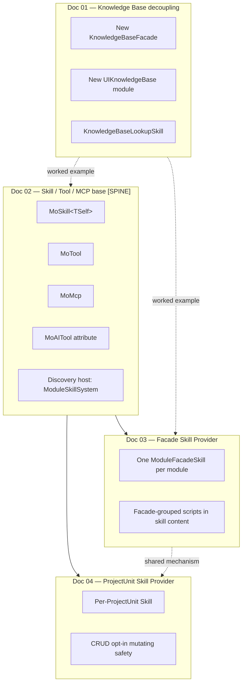

# Doc 00 — Skill System Refactor Overview

> **Status.** Index for the five-doc Monica AI skill-system design set.
> **Audience.** Architecture reviewer; module owners across UI, Framework, and business domains.
> **Last revised.** 2026-04-29.

## 0. What this design set covers

Monica's chat agent capability surface is built on the Microsoft Agent Framework (`Microsoft.Agents.AI` v1.3.0). Today, exposing a capability to a chat agent in a Monica module requires substantial boilerplate, and the Knowledge Base management UI is fused with the RAG pipeline that just happens to consume the same data store. This design set fixes both, in five focused docs that an engineer can implement in four phases without reading all five at once.

| Doc | File | Concern |
|---|---|---|
| 01 | `01-knowledge-base-decoupling.md` | Split Knowledge Base management out of RAG. New `KnowledgeBaseFacade`, new `UIKnowledgeBase` UI module, lookup-only Skill that works without RAG. |
| 02 | `02-skill-tool-mcp-base.md` (**spine**) | Three new base classes (`MoSkill<TSelf>`, `MoTool`, `MoMcp`) + `[MoAITool]` attribute + description-priority chain + `IBusinessTypeIterator` discovery. |
| 03 | `03-monica-facade-skill-provider.md` | Auto-project every Monica module's Facade methods into one module Skill, with scripts grouped by Facade in the loaded skill content. |
| 04 | `04-projectunit-skill-provider.md` | Same idea as Doc 03 but for business `ApplicationService` and `CrudApplicationService` types — one Skill per ProjectUnit. CRUD mutating ops are opt-in. |

## 1. Background — current pain points

### 1.1 Knowledge Base UI is RAG-coupled

The "knowledge base" tool button in `Monica.AI.UI/UIChat/Components/ChatInputArea.razor` only renders when RAG is configured. CRUD on a knowledge base — listing, creating, deleting, indexing documents — lives inside `Monica.AI.UI/UIRAG/Pages/RAGManagePage.razor` mixed with chunker config and embedding-model binding. `ChatPageState` injects `RAGFacade` *only* to read the KB list. `RAGFacade` itself carries methods that are pure KB-CRUD (`CreateKnowledgeBaseAsync`, `UpdateKnowledgeBaseAsync`, `DeleteKnowledgeBaseAsync`, `GetKnowledgeBasesAsync`). The split between *KB-as-data-store* and *RAG-pipeline-over-that-store* doesn't exist in the code.

### 1.2 AI tool wiring is too manual

The single existing capability provider, `Monica.AI/RAG/Tools/KnowledgeSearchToolProvider.cs`, is 426 lines for four tools. Authors hand-roll `IAIChatToolProvider`, marshal each method through `Microsoft.Extensions.AI.AIFunctionFactory.Create`, and register with `services.TryAddEnumerable(...)`. There is no class-based authoring path, no tool description coming from XML doc comments, no MCP integration, and no general "every Facade is auto-exposed" mechanism.

### 1.3 No XML-doc → tool-description bridge

`Monica.Core/Modules/ModuleXmlDocumentation.cs` already exists and provides `IXmlDocumentationService.GetMethodDocumentation(MethodInfo)` returning method `<summary>` and per-parameter `<param>` docs. None of the existing tool authoring uses it. Tool descriptions are hand-written strings, often duplicated, and drift from the developer-facing XML docs.

### 1.4 Module dependency direction is unused

`Monica.Framework.csproj` already references `Monica.AI` (verified: line 26 of `Monica.Framework.csproj`). `Monica.Framework.UI.csproj` already references `Monica.AI.UI`. These edges exist but are not exploited for AI capability projection — `Monica.Framework` is the natural home for cross-cutting Skill providers (Facade, ProjectUnit) that span every Monica module, but no such providers exist today.

## 2. The four refactor strands



Doc 02 is the spine. Docs 03 and 04 normatively reference it. Doc 04 cross-references Doc 03 for shared mechanisms (`[MoAITool]`, description priority chain, `Res<T>` unwrap, selective-registration pattern). Doc 01 is independent of the others for base classes — the Knowledge Base extraction is purely a refactor of existing code paths — but Doc 01's `KnowledgeBaseFacade` and `KnowledgeBaseLookupSkill` are the worked examples Doc 02 and Doc 03 use.

## 3. Glossary — canonical definitions

Every term used in any of the five docs has exactly one definition here. Sub-docs may add detail but must not redefine.

| Term | Definition |
|---|---|
| **Skill** | A single deployable unit of agent capability scoped to a chat session. Owns metadata (kebab-case name, description, instructions). Surfaces through Microsoft Agent Framework's `Microsoft.Agents.AI.AgentSkill` base type. The L1 frontmatter is advertised in the system prompt; the L2 content (instructions + scripts + resources) flows in only when the agent activates the skill. |
| **Skill script** | A single function callable by the agent loop, owned by a Skill. In Microsoft's model: a method marked `[AgentSkillScript("name")]` on an `AgentClassSkill<TSelf>` subclass, or an item produced via `CreateScript(...)` on the explicit-override path. Backed by `Microsoft.Extensions.AI.AIFunction`. |
| **Skill resource** | A static or computed value owned by a Skill, surfaced to the agent as an inline resource (e.g., a reference template). Microsoft's `[AgentSkillResource]` on a property or method. |
| **Tool** (standalone) | A class-based AI tool not bundled into a Skill. Inherits `MoTool`. Useful for utilities the agent always has available. Backed by `Microsoft.Extensions.AI.AITool`. |
| **MCP service** | A Model Context Protocol server endpoint. Class-based via `MoMcp`. The exact wrapping package is verify-before-implement (Doc 02 §4). |
| **Facade** | A Monica module's host-facing public surface, returning `Res` / `Res<T>`. Lives in the infrastructure module, defined in `Facades/`. Examples: `RAGFacade`, `KnowledgeBaseFacade`, `JobSchedulerFacade`. Marker interface: `IMonicaFacade` (added in Phase C). |
| **Module Facade Skill** | An `AgentSkill` auto-generated by the Facade Provider (Doc 03) — one per Monica module that ships at least one selected Facade. Its scripts are the public methods of those Facades, grouped by Facade in the skill content. |
| **Module Skill** | Generic term for an `AgentSkill` whose frontmatter represents a Monica module. In Doc 03 this is the Module Facade Skill itself; it is not an empty aggregator and does not point to nested sub-skills. |
| **ProjectUnit Skill** | An `AgentSkill` auto-generated by the ProjectUnit Provider (Doc 04) — one per business `ProjectUnit`. Its scripts are the union of (a) Handle methods on Custom ApplicationServices in the unit and (b) read or opt-in mutating methods on CrudApplicationServices in the unit. |
| **KB lookup** vs **RAG retrieval** | KB lookup = listing KBs, browsing document trees, reading raw source content. Works without an embedding pipeline. RAG retrieval = semantic search over chunked, embedded text. Requires the RAG pipeline. Each is a separate Skill (Doc 01 §4). |
| `[MoAITool]` attribute | Method-or-parameter additive metadata. Three properties: `Name` (script/tool name override), `Description` (description override), `Disabled` (gate). On methods of a `MoSkill<TSelf>` subclass `[MoAITool]` is the **discovery marker** — without it the method is not exposed as a script (Microsoft's `[AgentSkillScript]` is not used on Monica skill methods). On Facade and ApplicationService methods (Docs 03 / 04) it is purely additive metadata since exposure is opt-out. If `Name` is omitted, the script name is auto-derived (kebab-case, drop trailing `Async`). On parameters, only `Description` is meaningful. Class-level usage forbidden by `AttributeUsage`. (Doc 02 §5.1) |
| **Description priority chain** | Resolution order for any tool / parameter description: (1) `[MoAITool(Description = ...)]`, (2) `[System.ComponentModel.Description(...)]`, (3) `IXmlDocumentationService.GetMethodDocumentation(...)`, (4) fallback `"{TypeName}.{MemberName}"` with a logged warning. (Doc 02 §5.2) |
| **`Res<T>` unwrap** | Rule for projecting Facade or ApplicationService methods returning `Res` / `Res<T>` / `ResPaged<T>` into agent scripts: success path is unwrapped (the script returns the inner `T`); failure throws `MoAIToolFailureException(res.Message)` so the framework reports it as a tool error. (Doc 03 §8, Doc 04 §9) |
| **`ModuleKey`** | Monica's typed module identifier. `readonly record struct` at `Monica.Core/Modularity/Models/ModuleKey.cs` with implicit conversions from `BuiltInModuleKey` (enum) and `string`. Use this — not `string` — for `RequiredModules` collections on `MoSkill<TSelf>`. |

## 4. Module dependency map

### 4.1 Existing edges this design exploits

```
Monica.Framework                  ──►  Monica.AI
Monica.Framework.UI               ──►  Monica.AI.UI
Monica.AI.UI                      ──►  Monica.AI
Monica.AI                         ──►  Microsoft.Agents.AI 1.3.0
                                  ──►  Microsoft.Extensions.AI 10.5.0
Monica.AI                         ──►  Monica.Framework  (NO — would create a cycle)
```

The fourth line is intentionally absent. `Monica.AI` does not depend on `Monica.Framework` — the Skill providers in `Monica.Framework` are *consumers* of `Monica.AI`'s base classes (`MoSkill<TSelf>`, `MoTool`, etc.), not the other way around.

### 4.2 New modules introduced

| Module | Project | Doc | Purpose |
|---|---|---|---|
| `ModuleKnowledgeBase` | `Monica.AI` | Doc 01 | KB CRUD, inventory, lookup-only Skill. New BuiltInModuleKey: `KnowledgeBase`. |
| `ModuleKnowledgeBaseUI` | `Monica.AI.UI` | Doc 01 | UIKnowledgeBase manage page, KB selector. New BuiltInModuleKey: `KnowledgeBaseUI`. |
| `ModuleSkillSystem` | `Monica.AI` | Doc 02 | Discovery host for `MoSkill<TSelf>` / `MoTool` / `MoMcp` subclasses; builds `AgentSkillsProvider`. |
| `ModuleAIFacadeProvider` | `Monica.Framework` | Doc 03 | Auto-project `IMonicaFacade`-marked Facades into one module-level Skill per Monica module. New BuiltInModuleKey: `AIFacadeProvider`. |
| `ModuleAIProjectUnitProvider` | `Monica.Framework` | Doc 04 | Auto-project ProjectUnits into per-ProjectUnit Skills. New BuiltInModuleKey: `AIProjectUnitProvider`. |

### 4.3 BuiltInModuleKey additions

`Monica.Core/Modularity/Models/BuiltInModuleKey.cs` adds:

- `KnowledgeBase` (next to `RAG`)
- `KnowledgeBaseUI` (next to `RAGUI`)
- `AIFacadeProvider`
- `AIProjectUnitProvider`

`AISkillSystem` is *not* added as a built-in — Doc 02 §6.1 declares `ModuleSkillSystem` with a string `ModuleKey` (`(ModuleKey)"AISkillSystem"`) for the v1 cut. Promotion to `BuiltInModuleKey` is a follow-up if the module proves stable.

## 5. Architecture: before vs after

### 5.1 Before — today's tool wiring

```
Chat session start
    │
    ▼
AIChatAgentFactory
    │
    ├── enumerates IAIChatToolProvider (TryAddEnumerable singletons)
    │
    └── for each provider:
            ConfigureAsync(builder, ctx):
              - reads ctx.KnowledgeBaseIds
              - builds 4 AITool instances per session via AIFunctionFactory.Create
              - hand-rolled descriptions in BuildKnowledgeSearchToolDescription
              - builder.AddTool(tool)

Resulting agent has flat AITool collection.
No Skill hierarchy. No XML-doc bridge. KB management UI lives inside RAG.
```

### 5.2 After — Skill-system-driven wiring

```
Startup phase (once)
    │
    ├── ModuleSkillSystem.IterateBusinessTypes:
    │       discovers MoSkill<TSelf> / MoTool / MoMcp subclasses
    │
    ├── ModuleAIFacadeProvider.PostConfigureServices:
    │       groups selected IMonicaFacade types by owning module,
    │       builds one ModuleFacadeSkill per module with scripts grouped by Facade
    │
    ├── ModuleAIProjectUnitProvider.PostConfigureServices:
    │       projects every ProjectUnit into a ProjectUnitSkill
    │       (CRUD mutating ops opt-in)
    │
    └── MonicaSkillsProviderHostedService:
            collects all AgentSkill services,
            applies RequiredModules / IsEnabled gates,
            calls AgentSkillsProviderBuilder.UseSkills(...).Build()

Chat session start
    │
    ▼
AIChatAgentFactory
    │
    ├── receives AIChatAgentCreateContext for agent construction only
    │       (instructions, not per-session feature state)
    │
    └── injects the singleton AgentSkillsProvider into the AIAgent

Chat run
    │
    ├── AIChatService snapshots the session's AIChatRuntimeContext
    │       into the ambient runtime-context accessor for this async run
    │
    └── RAGKnowledgeSkill scripts read the RAG-owned
            KnowledgeSelection key at execution time

Resulting agent has the full Skill hierarchy via Microsoft's progressive
disclosure: L1 frontmatter visible in the system prompt, L2 content only
when the agent activates a skill.

Important invariant: the singleton `AgentSkillsProvider` and generated skill
frontmatter/content are process-static. Per-session state such as selected
knowledge bases must never be embedded in skill descriptions, loaded skill
content, or `AIChatAgentCreateContext`; it flows through `AIChatRuntimeContext`
and is read only when a script/resource executes.
```

## 6. Implementation sequencing

Four implementation phases, A through D, with explicit ordering constraints and parallelism opportunities:

| Phase | Doc | Owns | Dependencies | Can run in parallel with |
|---|---|---|---|---|
| **A** | Doc 01 | KB extraction (`KnowledgeBaseFacade`, `UIKnowledgeBase`, lookup-only Skill contract) | None | Phase B |
| **B** | Doc 02 | Skill / Tool / MCP base classes + discovery host + `[MoAITool]` + migration of `KnowledgeSearchToolProvider` | None (Phase A is *not* required, but Phase A's `KnowledgeBaseFacade` and `KnowledgeBaseLookupSkill` are nice worked examples for Phase B's tests) | Phase A |
| **C** | Doc 03 | Facade Skill Provider in `Monica.Framework` | Phase A (worked example) + Phase B (base classes) | — |
| **D** | Doc 04 | ProjectUnit Skill Provider in `Monica.Framework` | Phase B (base classes) | Phase C (independent module — different file tree, no shared types beyond what Phase B owns) |
| E (out-of-scope) | — | Telemetry / `RecordState` integration; permission gating; MCP package selection | After all of A–D | — |

Phase A and Phase B can ship in either order — neither blocks the other. Phase C blocks on both. Phase D blocks on B but not C. The most parallel timeline:

```
t=0: A and B both start (different teams).
t=1: A merges. B merges.
t=1: C and D both start (different teams).
t=2: C merges. D merges.
```

The most sequential timeline (one team, one phase at a time) is `A → B → C → D`, four weeks of work.

### 6.1 Critical sequencing rules

- **Phase A must land before Phase C's worked example tests run.** Phase C uses `KnowledgeBaseFacade` as one of its three end-to-end examples. If Phase A slips, Phase C's tests fall back to a stub Facade.
- **Phase B must land before Phases C and D.** Both Providers extend `AgentClassSkill<TSelf>` via the explicit-override path defined in Doc 02 §2.1 / Doc 03 §2.1.
- **The `IMonicaFacade` marker rollout is part of Phase C, not Phase B.** Phase B does not require any existing Facade to implement `IMonicaFacade` — only the new lookup Skill (Doc 01) and the migrated `RAGKnowledgeSkill`.

## 7. Out-of-scope for this design set

The following are intentionally not addressed by Docs 00–04. Each has a forward-compat slot but no design content in this rev:

| Out-of-scope item | Slot reserved where | Future work |
|---|---|---|
| Telemetry on script invocations (the analog of Monica's `RecordState` for hosted services) | Doc 02 §11(c) | Phase E. A future telemetry doc owns this. |
| Permission gating on Facade and ProjectUnit Skills | Doc 02 §5.1 documents `[MoAITool(RequiredPermissions = ...)]` as a future property; not shipped in this rev. | A future security doc. |
| MCP package selection and the concrete `MoMcp` API | Doc 02 §4 (verify-before-implement) | Phase E. Implementer pins the MCP package, decompiles its public surface, finalizes `MoMcp`. |
| Dynamic / hot-reload skill registration | Doc 02 §7 — `AgentSkillsProvider` is built once at startup; the skill set is immutable per process. | Future iteration. |
| Per-session permission-based skill activation | Doc 02 §11(a) — gates evaluate at iterator phase only. | Tied to permission gating. |
| Hand-written module-specific Skills under a module-level umbrella | Doc 03 §3 — slot reserved for future child-skill references in `ModuleFacadeSkill` content. | Future iteration when concrete use cases emerge. |
| Command-vs-Query sub-Skill nesting in ProjectUnit projection | Doc 04 §10(a) — naming convention only in this rev. | Future iteration if domain teams demand it. |
| FluentValidation / `IValidatableObject` propagation into JSON schema | Doc 04 §7.3 — only `DataAnnotations` are mapped. | Future iteration. |
| `KnowledgeBaseSelector` cross-module home (third "AI primitives" UI module) | Doc 01 §6(b) — declined; KnowledgeBaseSelector lives in `UIKnowledgeBase`. | Reconsider only if a third UI consumer materializes. |
| Standalone `Monica.AI.KnowledgeBase` `.csproj` | Doc 01 §6(a) — declined; KB is a sub-feature of `Monica.AI`. | Reconsider only when a `Monica.AI`-external consumer appears. |
| Existing chat UI rendering changes | Out of scope — none of these docs touches `ChatPageState` rendering, message streaming, or model selection beyond the KB-list-load flip in Doc 01 §5.6. | Separate UI redesign initiative (if one is needed). |
| Existing embedding-model implementations | Out of scope — `EmbeddingModelFacade` stays in RAG with no API changes. | — |
| `RAGFacade` semantics for already-configured pipelines | Out of scope — pipeline behavior unchanged. KB-CRUD-shaped methods are deleted from `RAGFacade` (clean breaking change per Doc 01 §3.2); in-tree callers migrate atomically in the same PR. | — |

## 8. Required artifacts checklist

For the doc-writer of each phase to produce alongside the design doc, ahead of implementation review:

| Doc | Required artifact |
|---|---|
| 00 | Mermaid cross-doc graph (§2 of this doc — done). Terminology table (§3 — done). Before / after architecture diagrams (§5 — done). |
| 01 | Before / after dependency graph for the UI side (file paths). API classification table (every `RAGFacade` method tagged). Module dependency Mermaid. |
| 02 | Class diagram (Mermaid) `MoSkill<TSelf>` → `AgentClassSkill<TSelf>` → `AgentSkill`; sibling diagrams for `MoTool` and `MoMcp`. Lifecycle sequence diagram (iterator → singleton → script invocation). Side-by-side migration listing (`KnowledgeSearchToolProvider` → `RAGKnowledgeSkill`). Description-priority decision table with three example methods. |
| 03 | Three end-to-end example tables (XML source → module Skill script → `run_skill_script` call). Facade-grouped skill-content template. Discovery sequence diagram. Method default deny-list table. |
| 04 | Single end-to-end example (`PlaceOrderApplicationService` → script schema). CrudApplicationService default-exposure decision matrix. Cross-reference table with Doc 03. |

Doc 00 itself is complete with the artifacts inline.

## 9. Reading order suggestions

Different audiences benefit from different reading orders:

- **Architecture reviewer (one pass).** 00 → 02 → 03 → 04 → 01. Doc 02 anchors vocabulary; Docs 03 and 04 build on it; Doc 01 is the worked example.
- **Phase A implementer.** 00 → 01. Done.
- **Phase B implementer.** 00 → 02. Doc 01 is helpful context for the migration test fixture but not required.
- **Phase C implementer.** 00 → 02 → 03. Doc 01 needed for the worked example fixtures.
- **Phase D implementer.** 00 → 02 → 03 → 04. Doc 03 is the structural mirror; Doc 04 cross-references it heavily.
- **Module owner adopting the new system in their own module.** 00 → 03 (for Facade-style modules) or 00 → 04 (for ProjectUnit-style projects). Skip 01, 02 unless authoring a hand-written `MoSkill<TSelf>`.

## 10. Cross-doc reference index

Every cross-reference asserted in this design set, in one table:

| From doc § | To doc § | What is referenced |
|---|---|---|
| 00 §3 (this) | 01 §0 | KB lookup vs RAG retrieval definitions |
| 00 §3 | 02 §5.1 | `[MoAITool]` attribute spec |
| 00 §3 | 02 §5.2 | Description priority chain |
| 00 §3 | 03 §8 / 04 §9 | `Res<T>` unwrap rule |
| 01 §4.2 | 02 §0 | `MoSkill<TSelf>` base class for `KnowledgeBaseLookupSkill` |
| 02 §1.4 | `Monica.Core/Modularity/Models/ModuleKey.cs` | `ModuleKey` typed identifier |
| 02 §6.1 | 03 §1.2 / 04 §1.4 | `ModuleSkillSystem` is the discovery host both Providers depend on |
| 03 §1.1 | `Monica.Framework.csproj` line 26 | Existing `Monica.Framework → Monica.AI` reference |
| 03 §4.1 | 02 §11(c) | `IMonicaFacade` lives in `Monica.AI/Skills/Abstractions/` (Doc 02 reserves the home; Doc 03 names the interface) |
| 03 §6 | `Monica.WebApi/Abstractions/ApplicationService.cs` | ApplicationService base used by Doc 04 |
| 03 §8 | 04 §9 | `Res<T>` unwrap rule shared across both Providers |
| 04 §6 | 03 §6 | Discovery hook contract (each Provider has its own iterator step) |
| 04 §12 | 03 (table) | Cross-reference table comparing the two Providers |
| All | `Microsoft.Agents.AI.xml` at `/mnt/c/Users/mo/.nuget/packages/microsoft.agents.ai/1.3.0/lib/net10.0/Microsoft.Agents.AI.xml` | Source-of-truth for `AgentSkill`, `AgentClassSkill<TSelf>`, `[AgentSkillScript]`, etc. |

---

**End of Doc 00.**

The remaining four docs — 01, 02, 03, 04 — are independent files in this directory. Read them in the order recommended for your audience (§9).
